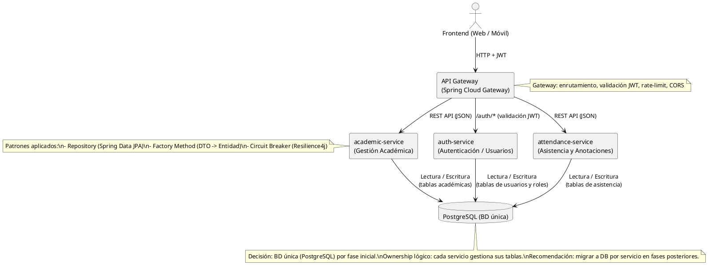
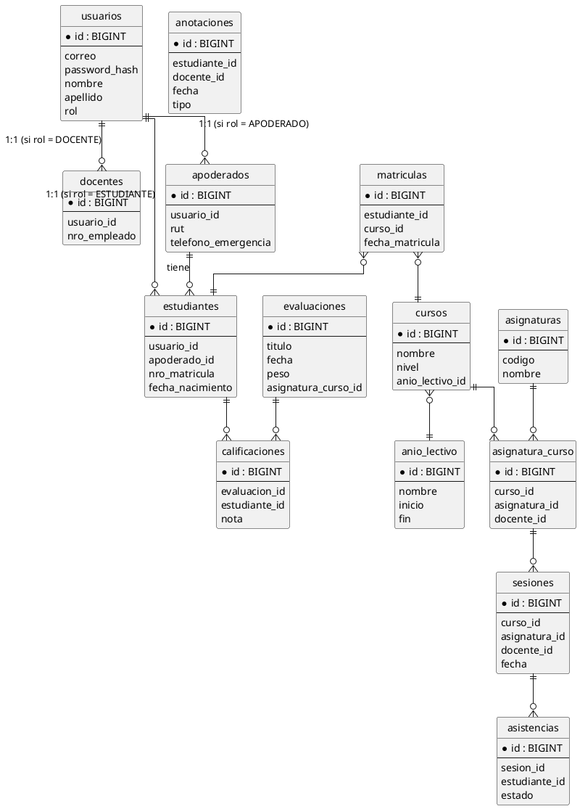

# Arquitectura y Patrones — Plataforma Libro de Clases Digital

Fecha: 2026-03-22 (actualizado)

## Resumen

Documento técnico que amplía el `project_overview.md`. Incluye la descripción de microservicios, patrones aplicados y artefactos (PlantUML y DDL) en formato embebido para copiar/pegar en StarUML o en el entorno de BD.


## Microservicios (lista y responsabilidades)

- auth-service: autenticación y gestión de usuarios y roles (emite JWT).
- academic-service: gestión académica (cursos, asignaturas, matrículas, evaluaciones, calificaciones).
- attendance-service: sesiones, registro de asistencias y anotaciones de conducta.
- API Gateway: punto de entrada (Spring Cloud Gateway). Valida JWT, enruta y aplica políticas transversales (rate limiting, CORS).


## Decisiones principales

- Lenguaje: Java + Spring Boot
- Persistencia: PostgreSQL (BD única por fase inicial)
- Comunicación: REST HTTP/JSON entre frontend y microservicios; Gateway centralizado
- **Identificadores**: `BIGINT` auto-incremental (`GENERATED BY DEFAULT AS IDENTITY`). Se eligió esta estrategia para simplificar el desarrollo y la depuración durante la fase de aprendizaje del proyecto, en lugar de UUIDs.
- Borrado: borrado físico (`ON DELETE CASCADE`) + tabla `auditoria_borrados` para traza mínima
- Patrones: Repository (Spring Data JPA), Factory Method, Circuit Breaker (Resilience4j)

## PlantUML: diagrama de microservicios

Copia el siguiente bloque a un archivo `.puml` o pégalo en un editor PlantUML / StarUML:



## PlantUML: modelo ER (versión simplificada)

Copia el siguiente bloque para generar el ER en PlantUML o para usarlo en StarUML:



## DDL (extracto)

A continuación incluyo el DDL mínimo en SQL (PostgreSQL). Cópialo a un archivo `initial_schema.sql` si quieres ejecutar en tu BD de pruebas.

```sql
-- Usaremos IDs auto-incrementales para simplificar el desarrollo.
-- La extensión "uuid-ossp" ya no es necesaria.

CREATE TABLE usuarios (
  id BIGINT GENERATED BY DEFAULT AS IDENTITY PRIMARY KEY,
  correo varchar(255) UNIQUE NOT NULL,
  password_hash varchar(255) NOT NULL,
  nombre varchar(100),
  apellido varchar(100),
  telefono varchar(50),
  rol varchar(30),
  activo boolean DEFAULT true,
  creado_en timestamptz DEFAULT now(),
  actualizado_en timestamptz DEFAULT now()
);

-- (El resto del DDL se encuentra en `ddl/initial_schema.sql`.)
```

## Patrones de Diseño Aplicados

Esta sección documenta en detalle los tres patrones de diseño seleccionados para el proyecto, su justificación, beneficios y ejemplos de implementación.

---

### 1. Repository Pattern (con Spring Data JPA)

#### ¿Qué es?

El patrón Repository actúa como una **capa de abstracción entre la lógica de negocio y la capa de acceso a datos**. Encapsula la lógica necesaria para acceder a las fuentes de datos (base de datos, APIs externas, etc.) y proporciona una interfaz más orientada a objetos para el resto de la aplicación.

#### ¿Por qué lo usamos?

En este proyecto, el patrón Repository nos permite:

1. **Desacoplar** la lógica de negocio de los detalles de persistencia (SQL, JPA, etc.)
2. **Facilitar el testing**: Podemos crear implementaciones mock de los repositorios sin necesidad de base de datos real
3. **Centralizar queries**: Todas las consultas a BD están en un solo lugar, fácil de mantener
4. **Aprovechar Spring Data JPA**: Genera implementaciones automáticas basadas en convenciones de nombres

#### Beneficios específicos para nuestro proyecto

- **Mantenibilidad**: Si cambiamos de PostgreSQL a otra BD, solo modificamos los repositorios
- **Testabilidad**: Las pruebas unitarias de servicios no requieren BD gracias a los mocks
- **Productividad**: Spring Data JPA reduce código boilerplate (no necesitamos escribir queries básicos)
- **Consistencia**: Todos los microservicios siguen el mismo patrón de acceso a datos

#### Ejemplo de implementación

**Entidad (Estudiante.java)**

```java
@Entity
@Table(name = "estudiantes")
@Data
@NoArgsConstructor
@AllArgsConstructor
public class Estudiante {
    
    @Id
    @GeneratedValue(strategy = GenerationType.IDENTITY)
    private Long id;
    
    @Column(name = "usuario_id", nullable = false)
    private Long usuarioId;
    
    @Column(name = "apoderado_id", nullable = false)
    private Long apoderadoId;
    
    @Column(name = "nro_matricula", unique = true)
    private String numeroMatricula;
    
    @Column(name = "fecha_nacimiento")
    private LocalDate fechaNacimiento;
    
    @Column(name = "creado_en")
    private LocalDateTime creadoEn;
}
```

**Repository Interface (EstudianteRepository.java)**

```java
@Repository
public interface EstudianteRepository extends JpaRepository<Estudiante, Long> {
    
    // Spring Data JPA genera automáticamente la implementación
    Optional<Estudiante> findByNumeroMatricula(String numeroMatricula);
    
    List<Estudiante> findByApoderadoId(Long apoderadoId);
    
    // Query method personalizado
    @Query("SELECT e FROM Estudiante e WHERE e.usuarioId = :usuarioId")
    Optional<Estudiante> findByUsuarioId(@Param("usuarioId") Long usuarioId);
    
    // Query nativo si es necesario
    @Query(value = "SELECT * FROM estudiantes WHERE EXTRACT(YEAR FROM fecha_nacimiento) = :anio", 
           nativeQuery = true)
    List<Estudiante> findByAnioNacimiento(@Param("anio") int anio);
}
```

**Uso en Servicio (EstudianteService.java)**

```java
@Service
@RequiredArgsConstructor
public class EstudianteService {
    
    private final EstudianteRepository estudianteRepository;
    
    public EstudianteDTO obtenerEstudiantePorMatricula(String numeroMatricula) {
        Estudiante estudiante = estudianteRepository
            .findByNumeroMatricula(numeroMatricula)
            .orElseThrow(() -> new ResourceNotFoundException("Estudiante no encontrado"));
        
        return convertirADTO(estudiante);
    }
    
    public List<EstudianteDTO> obtenerEstudiantesPorApoderado(Long apoderadoId) {
        return estudianteRepository.findByApoderadoId(apoderadoId)
            .stream()
            .map(this::convertirADTO)
            .collect(Collectors.toList());
    }
    
    // La lógica de negocio NO sabe cómo se almacenan los datos
    // Solo interactúa con el repositorio mediante su interfaz
}
```

#### Testing con Mocks

```java
@ExtendWith(MockitoExtension.class)
class EstudianteServiceTest {
    
    @Mock
    private EstudianteRepository estudianteRepository;
    
    @InjectMocks
    private EstudianteService estudianteService;
    
    @Test
    void debeObtenerEstudiantePorMatricula() {
        // Arrange
        String matricula = "2024001";
        Estudiante estudiante = new Estudiante(1L, 10L, 5L, matricula, LocalDate.of(2010, 5, 15), null);
        when(estudianteRepository.findByNumeroMatricula(matricula))
            .thenReturn(Optional.of(estudiante));
        
        // Act
        EstudianteDTO resultado = estudianteService.obtenerEstudiantePorMatricula(matricula);
        
        // Assert
        assertNotNull(resultado);
        assertEquals(matricula, resultado.getNumeroMatricula());
        verify(estudianteRepository, times(1)).findByNumeroMatricula(matricula);
    }
}
```

---

### 2. Factory Method Pattern

#### ¿Qué es?

El patrón Factory Method define una **interfaz para crear objetos, pero delega a las subclases la decisión de qué clase instanciar**. Permite que una clase difiera la instanciación a subclases, promoviendo el bajo acoplamiento.

#### ¿Por qué lo usamos?

En nuestro proyecto lo aplicamos principalmente para:

1. **Creación de DTOs**: Convertir entidades JPA a objetos de transferencia de datos
2. **Generación de notificaciones**: Crear diferentes tipos de notificaciones según el evento
3. **Construcción de respuestas API**: Generar respuestas estandarizadas con diferentes estados

#### Beneficios específicos para nuestro proyecto

- **Extensibilidad**: Agregar nuevos tipos de anotaciones o notificaciones sin modificar código existente
- **Separación de responsabilidades**: El código que usa los objetos no necesita saber cómo crearlos
- **Mantenibilidad**: Centraliza la lógica de creación en un solo lugar

#### Caso de Uso: Factory para Anotaciones

En nuestro sistema, las anotaciones pueden ser de diferentes tipos (POSITIVA, NEGATIVA, NEUTRAL) y gravedades (LEVE, GRAVE, MUY_GRAVE). Usamos un Factory para crear el objeto apropiado.

**Modelo de dominio**

```java
public abstract class Anotacion {
    protected Long id;
    protected Long estudianteId;
    protected Long docenteId;
    protected LocalDate fecha;
    protected String descripcion;
    protected TipoAnotacion tipo;
    
    public abstract String generarMensajeNotificacion();
    public abstract boolean requiereNotificacionApoderado();
}

public class AnotacionPositiva extends Anotacion {
    @Override
    public String generarMensajeNotificacion() {
        return "Felicitaciones: " + descripcion;
    }
    
    @Override
    public boolean requiereNotificacionApoderado() {
        return true; // Siempre notificar buenas noticias
    }
}

public class AnotacionNegativa extends Anotacion {
    private Gravedad gravedad;
    
    @Override
    public String generarMensajeNotificacion() {
        return "Atención - " + gravedad + ": " + descripcion;
    }
    
    @Override
    public boolean requiereNotificacionApoderado() {
        return gravedad == Gravedad.GRAVE || gravedad == Gravedad.MUY_GRAVE;
    }
}
```

**Factory Implementation**

```java
@Component
public class AnotacionFactory {
    
    public Anotacion crearAnotacion(AnotacionDTO dto) {
        return switch (dto.getTipo()) {
            case POSITIVA -> crearAnotacionPositiva(dto);
            case NEGATIVA -> crearAnotacionNegativa(dto);
            case NEUTRAL -> crearAnotacionNeutral(dto);
            default -> throw new IllegalArgumentException("Tipo de anotación desconocido: " + dto.getTipo());
        };
    }
    
    private AnotacionPositiva crearAnotacionPositiva(AnotacionDTO dto) {
        AnotacionPositiva anotacion = new AnotacionPositiva();
        anotacion.setEstudianteId(dto.getEstudianteId());
        anotacion.setDocenteId(dto.getDocenteId());
        anotacion.setFecha(LocalDate.now());
        anotacion.setDescripcion(dto.getDescripcion());
        anotacion.setTipo(TipoAnotacion.POSITIVA);
        return anotacion;
    }
    
    private AnotacionNegativa crearAnotacionNegativa(AnotacionDTO dto) {
        AnotacionNegativa anotacion = new AnotacionNegativa();
        anotacion.setEstudianteId(dto.getEstudianteId());
        anotacion.setDocenteId(dto.getDocenteId());
        anotacion.setFecha(LocalDate.now());
        anotacion.setDescripcion(dto.getDescripcion());
        anotacion.setTipo(TipoAnotacion.NEGATIVA);
        anotacion.setGravedad(dto.getGravedad());
        return anotacion;
    }
    
    private AnotacionNeutral crearAnotacionNeutral(AnotacionDTO dto) {
        // Implementación similar
        return new AnotacionNeutral();
    }
}
```

**Uso en el Servicio**

```java
@Service
@RequiredArgsConstructor
public class AnotacionService {
    
    private final AnotacionFactory anotacionFactory;
    private final AnotacionRepository anotacionRepository;
    private final NotificacionService notificacionService;
    
    public AnotacionDTO registrarAnotacion(AnotacionDTO dto) {
        // El servicio NO sabe qué tipo concreto de anotación se crea
        Anotacion anotacion = anotacionFactory.crearAnotacion(dto);
        
        // Guardar en BD
        Anotacion guardada = anotacionRepository.save(anotacion);
        
        // Si requiere notificación, enviarla
        if (anotacion.requiereNotificacionApoderado()) {
            notificacionService.notificarApoderado(
                anotacion.getEstudianteId(), 
                anotacion.generarMensajeNotificacion()
            );
        }
        
        return convertirADTO(guardada);
    }
}
```

#### Ventajas de este enfoque

1. **Código cliente limpio**: El servicio no necesita `if/else` para decidir qué tipo crear
2. **Fácil extensión**: Agregar nuevo tipo de anotación solo requiere crear nueva clase y actualizar factory
3. **Polimorfismo**: Cada tipo de anotación define su propio comportamiento
4. **Testing simplificado**: Podemos mockear el factory para pruebas

---

### 3. Circuit Breaker Pattern (con Resilience4j)

#### ¿Qué es?

El patrón Circuit Breaker **previene que una aplicación intente realizar una operación que probablemente fallará**. Funciona como un interruptor eléctrico que "se abre" cuando detecta demasiados fallos, evitando llamadas innecesarias y permitiendo que el sistema se recupere.

#### Estados del Circuit Breaker

1. **CLOSED (Cerrado)**: Estado normal, las peticiones pasan normalmente
2. **OPEN (Abierto)**: Demasiados fallos detectados, las peticiones se rechazan inmediatamente sin intentar
3. **HALF_OPEN (Semi-abierto)**: Permite algunas peticiones de prueba para verificar si el servicio se recuperó

```
   ┌─────────┐
   │ CLOSED  │ ◄──────────────┐
   └────┬────┘                 │
        │ Threshold            │ Success
        │ exceeded             │ threshold
        ▼                      │ exceeded
   ┌─────────┐                 │
   │  OPEN   │                 │
   └────┬────┘                 │
        │ Timeout              │
        │ elapsed              │
        ▼                      │
   ┌──────────┐                │
   │HALF_OPEN │───────────────┘
   └──────────┘
```

#### ¿Por qué lo usamos?

En arquitectura de microservicios, la falla de un servicio puede causar **efecto cascada** y tumbar toda la aplicación. Circuit Breaker:

1. **Previene sobrecarga**: No sigue llamando a un servicio caído
2. **Mejora resiliencia**: El sistema sigue funcionando parcialmente
3. **Tiempo de recuperación**: Permite que el servicio caído se recupere sin recibir más tráfico
4. **Feedback rápido**: Falla rápidamente en vez de esperar timeouts largos

#### Caso de uso en nuestro proyecto

Cuando el `academic-service` necesita obtener información de usuarios desde `auth-service`, aplicamos Circuit Breaker para manejar fallos.

**Configuración en `application.yml`**

```yaml
resilience4j:
  circuitbreaker:
    instances:
      authService:
        # Registrar métricas de salud
        registerHealthIndicator: true
        
        # Tamaño del buffer en estado CLOSED (últimas N llamadas consideradas)
        slidingWindowSize: 10
        
        # Mínimo de llamadas antes de calcular tasa de error
        minimumNumberOfCalls: 5
        
        # Umbral de error para abrir el circuito (50%)
        failureRateThreshold: 50
        
        # Tiempo en estado OPEN antes de pasar a HALF_OPEN
        waitDurationInOpenState: 60s
        
        # Llamadas permitidas en HALF_OPEN para probar recuperación
        permittedNumberOfCallsInHalfOpenState: 3
        
        # Transición automática de OPEN a HALF_OPEN
        automaticTransitionFromOpenToHalfOpenEnabled: true
        
        # Excepciones que cuentan como fallo
        recordExceptions:
          - java.io.IOException
          - java.util.concurrent.TimeoutException
          - org.springframework.web.client.ResourceAccessException
```

**Implementación en el Servicio**

```java
@Service
@RequiredArgsConstructor
@Slf4j
public class CursoService {
    
    private final CursoRepository cursoRepository;
    private final RestTemplate restTemplate;
    
    @CircuitBreaker(name = "authService", fallbackMethod = "obtenerDocenteFallback")
    @Retry(name = "authService")
    public DocenteDTO obtenerDocenteDelCurso(Long docenteId) {
        log.info("Llamando a auth-service para obtener docente ID: {}", docenteId);
        
        String url = "http://auth-service/api/users/docente/" + docenteId;
        
        // Esta llamada está protegida por Circuit Breaker
        ResponseEntity<DocenteDTO> response = restTemplate.getForEntity(url, DocenteDTO.class);
        
        return response.getBody();
    }
    
    /**
     * Método fallback ejecutado cuando el Circuit Breaker está OPEN
     * o cuando la llamada falla después de todos los reintentos
     */
    private DocenteDTO obtenerDocenteFallback(Long docenteId, Exception ex) {
        log.warn("Circuit Breaker activado para auth-service. Usando respuesta por defecto. Error: {}", 
                 ex.getMessage());
        
        // Retornar respuesta degradada (datos mínimos o cacheados)
        DocenteDTO fallback = new DocenteDTO();
        fallback.setId(docenteId);
        fallback.setNombre("Información no disponible temporalmente");
        fallback.setDisponible(false);
        
        return fallback;
    }
}
```

**Configuración de Retry (complementario)**

```yaml
resilience4j:
  retry:
    instances:
      authService:
        # Intentos máximos
        maxAttempts: 3
        
        # Espera entre reintentos (exponencial)
        waitDuration: 1s
        
        # Multiplicador para backoff exponencial
        exponentialBackoffMultiplier: 2
        
        # Reintentar solo en estas excepciones
        retryExceptions:
          - org.springframework.web.client.ResourceAccessException
```

**Monitoreo del Circuit Breaker**

```java
@RestController
@RequestMapping("/actuator/custom")
@RequiredArgsConstructor
public class CircuitBreakerHealthController {
    
    private final CircuitBreakerRegistry circuitBreakerRegistry;
    
    @GetMapping("/circuit-breaker-status")
    public Map<String, Object> getCircuitBreakerStatus() {
        Map<String, Object> status = new HashMap<>();
        
        circuitBreakerRegistry.getAllCircuitBreakers().forEach(cb -> {
            CircuitBreaker.Metrics metrics = cb.getMetrics();
            
            Map<String, Object> cbStatus = new HashMap<>();
            cbStatus.put("state", cb.getState().name());
            cbStatus.put("failureRate", metrics.getFailureRate());
            cbStatus.put("numberOfFailedCalls", metrics.getNumberOfFailedCalls());
            cbStatus.put("numberOfSuccessfulCalls", metrics.getNumberOfSuccessfulCalls());
            
            status.put(cb.getName(), cbStatus);
        });
        
        return status;
    }
}
```

**Ejemplo de respuesta del endpoint de monitoreo:**

```json
{
  "authService": {
    "state": "CLOSED",
    "failureRate": 12.5,
    "numberOfFailedCalls": 1,
    "numberOfSuccessfulCalls": 7
  }
}
```

#### Beneficios para nuestro proyecto

1. **Alta disponibilidad**: Si auth-service cae, academic-service sigue funcionando con datos degradados
2. **Prevención de cascada**: Los fallos no se propagan a otros servicios
3. **Recuperación automática**: El circuito se cierra solo cuando el servicio se recupera
4. **Mejor experiencia de usuario**: Respuestas rápidas en vez de timeouts largos
5. **Observabilidad**: Métricas del Circuit Breaker nos alertan de problemas

#### Testing del Circuit Breaker

```java
@SpringBootTest
@AutoConfigureMockMvc
class CircuitBreakerIntegrationTest {
    
    @Autowired
    private CursoService cursoService;
    
    @MockBean
    private RestTemplate restTemplate;
    
    @Test
    void debeLanzarFallbackCuandoAuthServiceFalla() {
        // Simular que auth-service está caído
        when(restTemplate.getForEntity(anyString(), eq(DocenteDTO.class)))
            .thenThrow(new ResourceAccessException("Service unavailable"));
        
        // Llamar varias veces para abrir el circuito
        for (int i = 0; i < 10; i++) {
            DocenteDTO resultado = cursoService.obtenerDocenteDelCurso(1L);
            
            // Verificar que se usa el fallback
            assertFalse(resultado.isDisponible());
            assertEquals("Información no disponible temporalmente", resultado.getNombre());
        }
    }
}
```

---

## Arquitectura de Seguridad

Esta sección documenta la estrategia de seguridad del proyecto, incluyendo autenticación, autorización, protección de microservicios y consideraciones para despliegue en AWS.

---

### Estrategia General de Seguridad

La plataforma implementa un modelo de seguridad basado en **JSON Web Tokens (JWT)** con las siguientes características:

1. **Autenticación centralizada** en `auth-service`
2. **Validación de tokens** en API Gateway (punto único de entrada)
3. **Autorización basada en roles** (RBAC - Role-Based Access Control)  
4. **Comunicación segura** HTTPS/TLS en producción
5. **Protección de passwords** mediante BCrypt
6. **Gestión de sesiones** con refresh tokens y blacklist

---

### Componentes de Seguridad

#### 1. Auth Service (Servicio de Autenticación)

**Responsabilidades:**
- Validar credenciales (correo + password)
- Generar tokens JWT firmados
- Gestionar refresh tokens
- Proveer endpoints de registro y recuperación de contraseña
- Revocar tokens (logout)

**Tecnologías:**
- **Spring Security**: Framework de seguridad
- **JWT (jjwt biblioteca)**: Generación y validación de tokens
- **BCrypt**: Hash de contraseñas (10 rounds)

**Endpoints principales:**
```
POST /auth/login       - Autenticación
POST /auth/register    - Registro de usuario
POST /auth/refresh     - Renovar JWT
POST /auth/logout      - Revocar token (agregar a blacklist)
POST /auth/verify      - Validar token vigente
```

---

#### 2. API Gateway (Punto de Control)

**Responsabilidades:**
- Validar JWT en CADA petición entrante
- Verificar expiración de tokens
- Consultar blacklist (tokens revocados)
- Extraer claims (rol, userId) y agregarlos a headers
- Aplicar políticas CORS
- Rate limiting por usuario/IP

**Configuración Spring Cloud Gateway:**

```yaml
spring:
  cloud:
    gateway:
      routes:
        - id: auth-service
          uri: lb://auth-service
          predicates:
            - Path=/auth/**
          filters:
            - StripPrefix=1
            
        - id: academic-service
          uri: lb://academic-service
          predicates:
            - Path=/academic/**
          filters:
            - StripPrefix=1
            - JWTAuthenticationFilter  # Custom filter
```

**Custom Filter (JWTAuthenticationFilter):**

```java
@Component
public class JWTAuthenticationFilter implements GatewayFilter {
    
    @Override
    public Mono<Void> filter(ServerWebExchange exchange, GatewayFilterChain chain) {
        String token = extractToken(exchange.getRequest());
        
        if (token == null) {
            exchange.getResponse().setStatusCode(HttpStatus.UNAUTHORIZED);
            return exchange.getResponse().setComplete();
        }
        
        try {
            Claims claims = jwtUtil.validateToken(token);
            
            // Verificar blacklist
            if (tokenBlacklistService.isBlacklisted(token)) {
                exchange.getResponse().setStatusCode(HttpStatus.UNAUTHORIZED);
                return exchange.getResponse().setComplete();
            }
            
            // Agregar claims a headers para que microservicios los usen
            ServerHttpRequest modifiedRequest = exchange.getRequest().mutate()
                .header("X-User-Id", claims.get("userId").toString())
                .header("X-User-Role", claims.get("rol").toString())
                .header("X-User-Email", claims.get("correo").toString())
                .build();
            
            return chain.filter(exchange.mutate().request(modifiedRequest).build());
            
        } catch (ExpiredJwtException e) {
            exchange.getResponse().setStatusCode(HttpStatus.UNAUTHORIZED);
            return exchange.getResponse().setComplete();
        }
    }
}
```

---

#### 3. Modelo de Roles y Permisos

**Roles del sistema:**

| Rol | Descripción | Permisos principales |
|-----|-------------|---------------------|
| **ADMIN** | Administrador del sistema | Acceso total: gestión de usuarios, cursos, configuración general |
| **DOCENTE** | Profesor/Instructor | Registrar asistencia, calificaciones, anotaciones; ver su curso |
| **APODERADO** | Padre/Tutor legal | Ver información de sus pupilos (calificaciones, asistencia, anotaciones) |
| **ESTUDIANTE** | Alumno | Ver sus propias calificaciones, asistencia y anotaciones |

**Matriz de permisos (ejemplos):**

| Endpoint | ADMIN | DOCENTE | APODERADO | ESTUDIANTE |
|----------|-------|---------|-----------|------------|
| `GET /academic/cursos` | ✅ | ✅ | ❌ | ❌ |
| `POST /academic/cursos` | ✅ | ❌ | ❌ | ❌ |
| `GET /attendance/asistencia/curso/:id` | ✅ | ✅ (solo su curso) | ❌ | ❌ |
| `POST /attendance/asistencia` | ✅ | ✅ | ❌ | ❌ |
| `GET /academic/calificaciones/estudiante/:id` | ✅ | ✅ (estudiantes de su curso) | ✅ (solo sus pupilos) | ✅ (solo propias) |

**Implementación de validación de roles en microservicios:**

```java
@RestController
@RequestMapping("/api/calificaciones")
public class CalificacionController {
    
    @GetMapping("/estudiante/{estudianteId}")
    @PreAuthorize("hasAnyRole('ADMIN', 'DOCENTE', 'APODERADO', 'ESTUDIANTE')")
    public ResponseEntity<List<CalificacionDTO>> obtenerCalificaciones(
            @PathVariable Long estudianteId,
            @RequestHeader("X-User-Id") Long userId,
            @RequestHeader("X-User-Role") String rol) {
        
        // Validación adicional según rol
        if (rol.equals("ESTUDIANTE") && !estudianteId.equals(userId)) {
            return ResponseEntity.status(HttpStatus.FORBIDDEN).build();
        }
        
        if (rol.equals("APODERADO")) {
            if (!apoderadoService.esApoderadoDe(userId, estudianteId)) {
                return ResponseEntity.status(HttpStatus.FORBIDDEN).build();
            }
        }
        
        // Si pasa todas las validaciones, obtener datos
        List<CalificacionDTO> calificaciones = calificacionService.obtener(estudianteId);
        return ResponseEntity.ok(calificaciones);
    }
}
```

---

### Flujo de Autenticación y Autorización

**Ver diagrama:** `diagrams/security_flow.puml`

#### Fase 1: Login (Autenticación)

1. Usuario ingresa credenciales en frontend
2. Frontend envía `POST /auth/login` con `{correo, password}`
3. Auth-service valida contra BD:
   - Busca usuario por correo
   - Verifica password con BCrypt
4. Si válido, genera JWT con claims:
   ```json
   {
     "userId": 123,
     "correo": "docente@colegio.cl",
     "rol": "DOCENTE",
     "nombre": "Juan Pérez",
     "iat": 1711700000,
     "exp": 1711786400
   }
   ```
5. Retorna JWT + datos de usuario
6. Frontend guarda JWT en `localStorage` o `sessionStorage`

#### Fase 2: Acceso a recursos protegidos (Autorización)

1. Usuario solicita ver calificaciones
2. Frontend agrega header: `Authorization: Bearer {JWT}`
3. API Gateway intercepta, valida JWT:
   - Verifica firma digital
   - Verifica que no expiró
   - Consulta blacklist
4. Si válido, extrae claims y agrega headers personalizados
5. Enruta al microservicio correspondiente
6. Microservicio valida permisos según rol
7. Si autorizado, retorna datos

#### Fase 3: Refresh Token

- JWT tiene validez corta (24 horas)
- Refresh token tiene validez larga (7 días)
- Antes de expiración, frontend puede renovar:
  ```
  POST /auth/refresh
  Header: Authorization: Bearer {JWT}
  
  Response: {newJWT, newRefreshToken}
  ```

---

### Modelo de Datos de Seguridad

**Ver diagrama:** `diagrams/security_data_model.puml`

#### Tabla: usuarios

```sql
CREATE TABLE usuarios (
  id BIGINT GENERATED BY DEFAULT AS IDENTITY PRIMARY KEY,
  correo VARCHAR(255) UNIQUE NOT NULL,
  password_hash VARCHAR(255) NOT NULL,  -- BCrypt hash
  nombre VARCHAR(100),
  apellido VARCHAR(100),
  rol VARCHAR(30),  -- ADMIN, DOCENTE, APODERADO, ESTUDIANTE
  activo BOOLEAN DEFAULT true,
  creado_en TIMESTAMPTZ DEFAULT now(),
  actualizado_en TIMESTAMPTZ DEFAULT now()
);
```

#### Tabla: refresh_tokens

```sql
CREATE TABLE refresh_tokens (
  id BIGINT GENERATED BY DEFAULT AS IDENTITY PRIMARY KEY,
  usuario_id BIGINT NOT NULL REFERENCES usuarios(id) ON DELETE CASCADE,
  token VARCHAR(500) UNIQUE NOT NULL,
  fecha_expiracion TIMESTAMPTZ NOT NULL,
  creado_en TIMESTAMPTZ DEFAULT now(),
  revocado BOOLEAN DEFAULT false
);
```

**Propósito:** Permitir renovación de JWT sin solicitar credenciales nuevamente.

#### Tabla: token_blacklist

```sql
CREATE TABLE token_blacklist (
  id BIGINT GENERATED BY DEFAULT AS IDENTITY PRIMARY KEY,
  token VARCHAR(500) UNIQUE NOT NULL,
  usuario_id BIGINT REFERENCES usuarios(id),
  razon VARCHAR(100),  -- LOGOUT, PASSWORD_CHANGED, COMPROMISED
  blacklisted_en TIMESTAMPTZ DEFAULT now()
);
```

**Propósito:** Invalidar tokens antes de su expiración natural (logout, cambio de password, seguridad comprometida).

---

### Consideraciones para Despliegue en AWS

Si se despliega en AWS, se recomienda la siguiente arquitectura de seguridad:

#### Opción 1: API Gateway de AWS + Lambda

```
Internet → AWS API Gateway → Lambda (Auth) → DynamoDB
                          ↓
                    Lambda (Academic)
                          ↓
                    Lambda (Attendance)
```

**Seguridad AWS:**
- **AWS API Gateway**: Validación de JWT mediante authorizers
- **AWS Cognito**: Gestión de usuarios e identidad (alternativa a auth-service custom)
- **AWS Secrets Manager**: Almacenar claves JWT y secretos
- **AWS WAF**: Web Application Firewall para protección DDoS
- **VPC**: Microservicios en red privada

**Configuración API Gateway AWS Authorizer:**

```json
{
  "type": "TOKEN",
  "authorizerUri": "arn:aws:lambda:region:account:function:jwt-authorizer",
  "authorizerResultTtlInSeconds": 300,
  "identitySource": "method.request.header.Authorization"
}
```

#### Opción 2: ECS/EKS con Application Load Balancer

```
Internet → ALB (HTTPS) → ECS/Fargate
                         ├─ auth-service
                         ├─ academic-service
                         └─ attendance-service
```

**Seguridad AWS:**
- **ACM (Certificate Manager)**: Certificados SSL/TLS
- **Application Load Balancer**: HTTPS termination, routing
- **IAM Roles**: Permisos entre servicios
- **Security Groups**: Control de tráfico inbound/outbound
- **AWS Secrets Manager**: Credenciales de BD
- **RDS PostgreSQL**: Base de datos gestionada con encriptación at-rest

---

### Configuración de Seguridad - application.yml

**Auth Service:**

```yaml
jwt:
  secret: ${JWT_SECRET}  # Variable de entorno
  expiration: 86400000    # 24 horas en ms
  refresh-expiration: 604800000  # 7 días en ms

spring:
  security:
    bcrypt:
      rounds: 10
```

**API Gateway:**

```yaml
security:
  jwt:
    secret: ${JWT_SECRET}
    header: Authorization
    prefix: "Bearer "
  
  cors:
    allowed-origins: 
      - https://colegio-frontend.com
      - http://localhost:3000  # Dev
    allowed-methods: GET,POST,PUT,DELETE,OPTIONS
    allowed-headers: "*"
    max-age: 3600
```

---

### Mejores Prácticas Implementadas

✅ **Passwords nunca en texto plano**: BCrypt con 10 rounds  
✅ **JWT firmado digitalmente**: HS256 con secret key  
✅ **HTTPS obligatorio en producción**: TLS 1.2+  
✅ **Tokens de corta duración**: 24 horas  
✅ **Refresh tokens para UX**: Sin solicitar credenciales frecuentemente  
✅ **Blacklist de tokens**: Logout efectivo  
✅ **Validación en Gateway**: Single point of control  
✅ **Principio de menor privilegio**: Cada rol solo accede a lo necesario  
✅ **Headers personalizados**: Microservicios reciben userId y rol validado  
✅ **Rate limiting**: Prevención de ataques de fuerza bruta  

---

### Diagramas de Seguridad

Los siguientes diagramas PlantUML documentan visualmente la arquitectura de seguridad:

1. **`diagrams/security_flow.puml`**: Flujo completo de autenticación y autorización (diagrama de secuencia)
2. **`diagrams/security_architecture.puml`**: Arquitectura de componentes de seguridad
3. **`diagrams/security_data_model.puml`**: Modelo de datos de seguridad (tablas)

Para generarlos en PNG/SVG, ejecutar PlantUML sobre estos archivos.

---

## Resumen: Justificación de patrones seleccionados

| Patrón | Problema que resuelve | Beneficio clave |
|--------|----------------------|-----------------|
| **Repository** | Acoplamiento entre lógica de negocio y persistencia | Testabilidad y mantenibilidad |
| **Factory Method** | Lógica de creación compleja y acoplada | Extensibilidad y bajo acoplamiento |
| **Circuit Breaker** | Fallos en cascada en microservicios | Resiliencia y alta disponibilidad |

Estos tres patrones trabajan en conjunto para crear una arquitectura **robusta, mantenible y escalable** que sigue las mejores prácticas de desarrollo de software empresarial.

---

## Configuración sugerida (snippets rápidos)

### Resilience4j (Circuit Breaker) - ejemplo `application.yml`

```yaml
resilience4j.circuitbreaker:
  instances:
    academicService:
      registerHealthIndicator: true
      ringBufferSizeInClosedState: 10
      ringBufferSizeInHalfOpenState: 2
      waitDurationInOpenState: 10s
      failureRateThreshold: 50
```

### JWT - Spring Security (snippet básico)

```java
http
  .csrf().disable()
  .authorizeRequests()
    .antMatchers("/auth/**").permitAll()
    .anyRequest().authenticated()
  .and()
  .addFilterBefore(new JwtAuthenticationFilter(jwtUtil), UsernamePasswordAuthenticationFilter.class);
```

## Observabilidad y despliegue

- Métricas: Micrometer + Prometheus
- Logs: formato JSON centralizado (EFK/ELK)
- Tracing: OpenTelemetry / Jaeger
- Despliegue recomendado: contenedores (Docker) y orquestador (Kubernetes) para escalado horizontal

---

_Nota: si quieres, puedo extraer el DDL completo aquí en este archivo o crear el archivo `ddl/initial_schema.sql` en el repo. Dime cómo lo prefieres._
