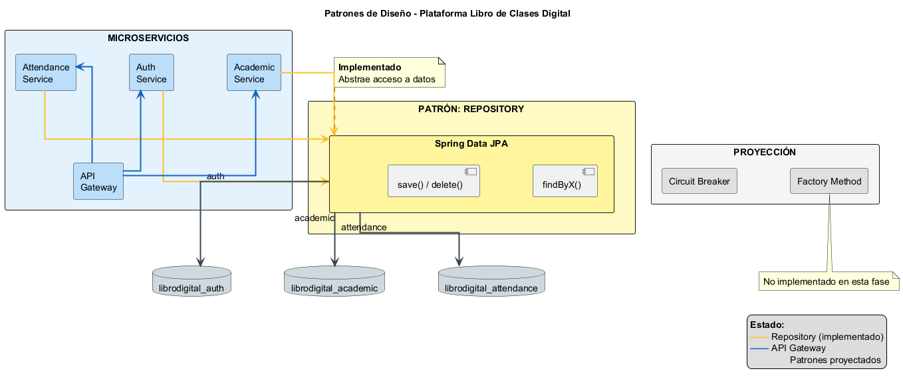
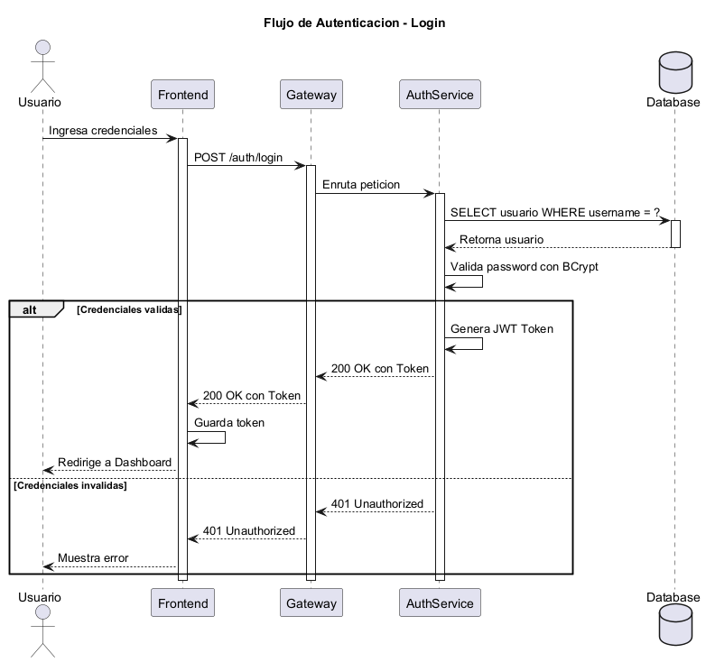

# 01 — Arquitectura de Microservicios

**Proyecto:** Plataforma Libro de Clases Digital  
**Asignatura:** DSY1106 — Desarrollo Fullstack III  
**Evaluación:** Parcial N°3 — Encargo  
**Equipo:** Cristian Monsalve / Héctor Olivares  

---

## 1. Resumen ejecutivo

El sistema implementa una **arquitectura de microservicios** para la gestión académica de un colegio: autenticación centralizada, dominio académico (estudiantes, cursos, notas) y dominio de asistencia (sesiones, registros, anotaciones). Todos los servicios backend se exponen al exterior a través de un **API Gateway**, y el **frontend React** consume únicamente ese punto de entrada.

La comunicación entre capas es **REST sobre HTTP/JSON**. Cada microservicio persiste en su **propia base PostgreSQL** (patrón *Database per Service*), sin claves foráneas entre bases distintas.

---

## 2. Diagrama de arquitectura



*Fuente editable:* `infraestructura/diagrams/architecture_patterns_simple.puml`

El diagrama muestra:

- **Cliente web** (`frontend-react`, puerto 8094)
- **API Gateway** (`apiGetaway`, puerto 8090) como único punto de entrada
- **Tres microservicios** backend con sus bases de datos dedicadas
- Patrones aplicados: API Gateway, Database per Service, Repository, DTO, Service Layer, MVC

---

## 3. Componentes del sistema

| Componente | Carpeta | Puerto | Responsabilidad |
|------------|---------|--------|-----------------|
| API Gateway | `apiGetaway/` | 8090 | Enrutamiento, CORS, proxy hacia microservicios |
| Auth Service | `authService/` | 8091 | Login, JWT, usuarios, roles (RBAC) |
| Academic Service | `academicService/` | 8092 | Estudiantes, docentes, cursos, matrículas, evaluaciones, notas |
| Attendance Service | `attendanceService/` | 8093 | Sesiones de clase, asistencia, anotaciones |
| Frontend React | `frontend-react/` | 8094 | UI por rol (admin, docente, apoderado, estudiante) |

---

## 4. Flujo de integración Frontend ↔ Backend ↔ Persistencia

```
┌─────────────────┐
│  frontend-react │  React 19 + TypeScript + Vite
│    :8094        │  VITE_API_URL → http://localhost:8090
└────────┬────────┘
         │  HTTP/JSON + Authorization: Bearer {JWT}
         ▼
┌─────────────────┐
│   apiGetaway    │  Spring Cloud Gateway 2025.1.2
│    :8090        │
└────────┬────────┘
         │
    ┌────┴────┬────────────┬──────────────┐
    ▼         ▼            ▼              ▼
/auth/**  /students/**  /sessions/**   /admin/**
    │     /courses/**   /attendances/**
    │     /grades/**    /annotations/**
    ▼         ▼            ▼
┌────────┐ ┌──────────┐ ┌──────────────┐
│  auth  │ │ academic │ │  attendance  │
│ :8091  │ │  :8092   │ │    :8093     │
└───┬────┘ └────┬─────┘ └──────┬───────┘
    ▼           ▼              ▼
 PostgreSQL   PostgreSQL      PostgreSQL
 librodigital librodigital    librodigital
    _auth       _academic       _attendance
```

### Rutas del Gateway (extracto)

| Prefijo | Destino | Servicio |
|---------|---------|----------|
| `/auth/**` | `http://localhost:8091` | authService |
| `/admin/**` | `http://localhost:8091` | authService |
| `/students/**`, `/courses/**`, `/teachers/**`, `/subjects/**` | `http://localhost:8092` | academicService |
| `/enrollments/**`, `/evaluations/**`, `/grades/**`, `/guardians/**` | `http://localhost:8092` | academicService |
| `/sessions/**`, `/attendances/**`, `/annotations/**` | `http://localhost:8093` | attendanceService |

El frontend **no** invoca directamente los puertos 8091–8093 en desarrollo; siempre usa el gateway en **8090**, lo que desacopla la UI de la topología interna.

---

## 5. API REST

La especificación de endpoints está documentada en:

- **Colección Postman:** `infraestructura/postman/Libro_Digital.postman_collection.json`
- **Guía de uso:** `infraestructura/postman/README.md`

Flujo típico de prueba:

1. `POST /auth/login` → obtiene `accessToken`
2. Peticiones subsiguientes con header `Authorization: Bearer {token}`
3. Operaciones CRUD en dominios academic y attendance según rol del usuario

---

## 6. Seguridad transversal



1. El usuario envía credenciales a `POST /auth/login`.
2. `authService` valida con **BCrypt** y emite **JWT** (`accessToken` + `refreshToken`).
3. Cada microservicio valida el token en rutas protegidas mediante filtro JWT.
4. **RBAC** con 4 roles: `ADMIN`, `DOCENTE`, `APODERADO`, `ESTUDIANTE`.
5. Registro público deshabilitado; provisión de usuarios vía `POST /admin/users` (solo ADMIN).

Usuarios demo: `admin_colegio`, `prof_castillo`, `apoderado_demo`, `estudiante_demo` — contraseña `test1234`.

---

## 7. Stack tecnológico

| Capa | Tecnologías |
|------|-------------|
| Backend | Java 21, Spring Boot 4.1.0, Spring Security, Spring Data JPA, Maven |
| Gateway | Spring Cloud Gateway 2025.1.2 |
| Frontend | React 19, TypeScript, Vite 8, Tailwind CSS, React Router |
| Base de datos | PostgreSQL 16+ (una instancia, tres bases lógicas) |
| Testing backend | JUnit 5, Mockito, Spring Boot Test, JaCoCo 0.8.12 |
| API testing | Postman Collection |

---

## 8. Patrones de diseño implementados

| Patrón | Aplicación en el proyecto |
|--------|---------------------------|
| **API Gateway** | `apiGetaway` centraliza rutas y simplifica el cliente |
| **Database per Service** | Tres bases PostgreSQL independientes |
| **Repository** | Interfaces `JpaRepository` por entidad |
| **DTO** | Objetos de transferencia separados de entidades JPA |
| **Service Layer** | Lógica de negocio en `*ServiceImpl`, controllers delgados |
| **MVC** | Controllers REST + modelos JPA + vistas React |

Detalle ampliado: `infraestructura/docs/patrones.md`

---

## 9. Orden de arranque recomendado

1. PostgreSQL (bases creadas con `infraestructura/ddl/00_create_databases.sql`)
2. `authService` → puerto 8091
3. `academicService` → puerto 8092
4. `attendanceService` → puerto 8093
5. `apiGetaway` → puerto 8090
6. `frontend-react` → puerto 8094 (`npm run dev`)

---

## 10. Diagramas complementarios

| Diagrama | Ubicación | Contenido |
|----------|-----------|-----------|
| ER Auth | `infraestructura/diagrams/auth_er_model.png` | Tablas `users`, `role`, `user_roles` |
| ER Academic | `infraestructura/diagrams/academic_er_model.png` | Catálogos + entidades académicas (3FN) |
| ER Attendance | `infraestructura/diagrams/attendance_er_model.png` | Sesiones, asistencia, anotaciones |
| Autorización RBAC | `infraestructura/diagrams/security_authorization.png` | Control de acceso por rol |

---

## 11. Conclusión

La arquitectura propuesta cumple los requisitos de la evaluación: **microservicios desacoplados**, **integración frontend-backend vía API REST**, **persistencia independiente por servicio** y **punto de entrada único** (gateway) que facilita el despliegue y las pruebas de integración con Postman.
