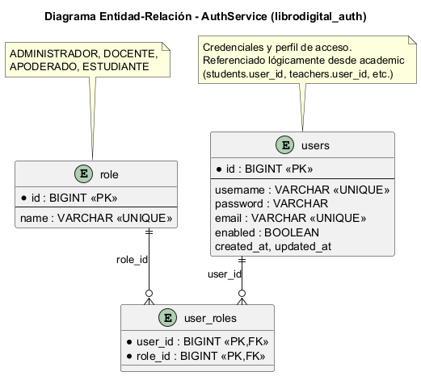
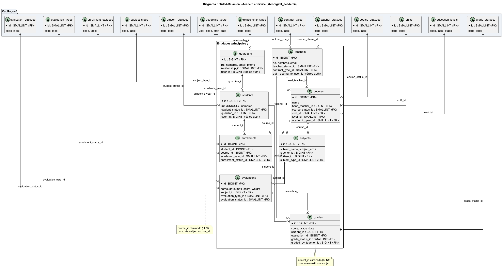
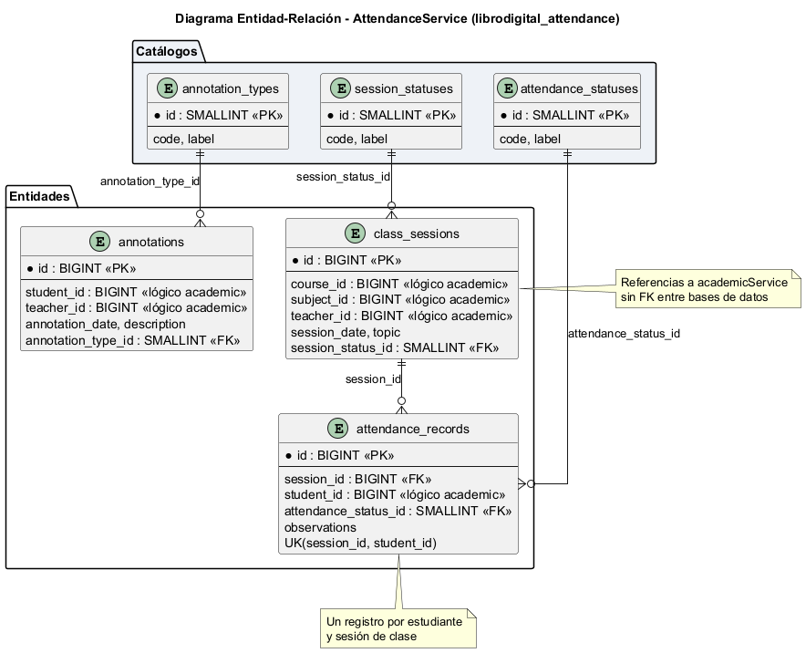

# 02 — Descripción de la Persistencia de Datos

**Proyecto:** Plataforma Libro de Clases Digital  
**Asignatura:** DSY1106 — Desarrollo Fullstack III  
**Evaluación:** Parcial N°3 — Encargo  
**Equipo:** Cristian Monsalve / Héctor Olivares  

---

## 1. Estrategia general

El proyecto adopta el patrón **Database per Service**: cada microservicio posee su propia base de datos PostgreSQL, gestionada de forma independiente. Esto garantiza:

- **Autonomía** de cada dominio (auth, académico, asistencia)
- **Escalabilidad** independiente por servicio
- **Aislamiento de fallos** entre dominios
- **Evolución de esquema** sin bloquear otros servicios

No existen **foreign keys entre bases distintas**. Las relaciones cruzadas (por ejemplo, `student_id` en attendance que referencia un estudiante en academic) se resuelven mediante **identificadores lógicos** validados en la capa de servicio o vía llamadas REST.

---

## 2. Inventario de bases de datos

| Base de datos | Microservicio | Puerto | Script DDL |
|---------------|---------------|--------|------------|
| `librodigital_auth` | authService | 8091 | `infraestructura/ddl/auth_schema.sql` |
| `librodigital_academic` | academicService | 8092 | `infraestructura/ddl/academic_schema.sql` |
| `librodigital_attendance` | attendanceService | 8093 | `infraestructura/ddl/attendance_schema.sql` |

Creación inicial de las tres bases:

```sql
-- infraestructura/ddl/00_create_databases.sql
CREATE DATABASE librodigital_auth;
CREATE DATABASE librodigital_academic;
CREATE DATABASE librodigital_attendance;
```

---

## 3. Tecnología de persistencia: Spring Data JPA + Hibernate

### 3.1 Configuración por microservicio

Cada servicio define su conexión en `application.properties`:

```properties
# Ejemplo authService
spring.datasource.url=jdbc:postgresql://localhost:5432/librodigital_auth
spring.datasource.username=postgres
spring.datasource.password=****
spring.jpa.hibernate.ddl-auto=update
spring.jpa.show-sql=false
spring.jpa.properties.hibernate.dialect=org.hibernate.dialect.PostgreSQLDialect
```

| Propiedad | Propósito |
|-----------|-----------|
| `spring.datasource.url` | URL JDBC a la BD del servicio |
| `spring.jpa.hibernate.ddl-auto=update` | Sincroniza esquema con entidades JPA en desarrollo |
| `PostgreSQLDialect` | Generación SQL compatible con PostgreSQL |

> En producción se recomienda `ddl-auto=validate` y aplicar cambios solo vía scripts versionados en `infraestructura/ddl/`.

### 3.2 Capas de acceso a datos

```
Controller (REST)
      ↓
Service / ServiceImpl  ← lógica de negocio y validaciones
      ↓
Repository (JpaRepository)  ← acceso a datos
      ↓
Entidad JPA (@Entity)  ← mapeo objeto-relacional
      ↓
PostgreSQL
```

**Ejemplo — authService:**

```java
@Entity
@Table(name = "users")
public class User {
    @Id @GeneratedValue(strategy = GenerationType.IDENTITY)
    private Long id;
    private String username;
    private String password;  // BCrypt hash
    @ManyToMany(fetch = FetchType.EAGER)
    @JoinTable(name = "user_roles", ...)
    private Set<Role> roles;
}

public interface UserRepository extends JpaRepository<User, Long> {
    Optional<User> findByUsername(String username);
}
```

### 3.3 Patrón Repository

Spring Data JPA genera implementaciones automáticas de repositorios. Ventajas:

- Consultas derivadas del nombre del método (`findByFirstName`)
- Integración con transacciones (`@Transactional`)
- Facilita pruebas unitarias con mocks (`@Mock UserRepository`)

---

## 4. Esquemas por servicio

### 4.1 librodigital_auth (authService)



| Tabla | Descripción |
|-------|-------------|
| `users` | Credenciales, email, estado activo |
| `role` | Catálogo de roles (`ADMIN`, `DOCENTE`, `APODERADO`, `ESTUDIANTE`) |
| `user_roles` | Relación N:M usuario ↔ rol |

**Normalización:** 3FN — los roles están en tabla separada; no hay redundancia de nombres de rol en `users`.

### 4.2 librodigital_academic (academicService)



El esquema académico fue **normalizado a Tercera Forma Normal (3FN)**:

- **Catálogos** reemplazan columnas VARCHAR categóricas:
  - `student_statuses`, `teacher_statuses`, `course_statuses`, `enrollment_statuses`
  - `evaluation_types`, `evaluation_statuses`, `grade_statuses`
  - `relationship_types`, `contract_types`, `subject_types`, `shifts`
  - `education_levels`, `academic_years`

- **Entidades principales** con claves foráneas internas:
  - `guardians`, `teachers`, `students`
  - `courses`, `subjects`, `enrollments`
  - `evaluations`, `grades`

**Beneficio de la normalización:** elimina redundancia, garantiza integridad referencial dentro del dominio académico y facilita consultas por catálogo.

### 4.3 librodigital_attendance (attendanceService)



| Tabla | Descripción |
|-------|-------------|
| `class_sessions` | Sesión de clase (fecha, curso, asignatura, docente — IDs lógicos) |
| `attendance_records` | Registro de asistencia por estudiante y sesión |
| `annotations` | Anotaciones de conducta vinculadas a estudiante/sesión |

**Referencias lógicas cross-service:**

| Campo en attendance | Referencia lógica | Servicio origen |
|---------------------|-------------------|-----------------|
| `course_id` | Curso | academicService |
| `subject_id` | Asignatura | academicService |
| `teacher_id` | Docente | academicService |
| `student_id` | Estudiante | academicService |

Estos IDs se validan en la capa de servicio; no hay FK física hacia `librodigital_academic`.

---

## 5. Scripts SQL y migraciones

Ubicación: `infraestructura/ddl/`

| Archivo | Uso |
|---------|-----|
| `00_create_databases.sql` | Crear las 3 bases |
| `auth_schema.sql` | Esquema completo auth + datos demo |
| `academic_schema.sql` | Esquema académico 3FN + catálogos + demo |
| `attendance_schema.sql` | Esquema asistencia + catálogos + demo |
| `migrations/001–004` | Solo para actualizar BDs creadas con esquema antiguo |

**Instalación nueva:** ejecutar `00_create_databases.sql` y luego cada `*_schema.sql`.

---

## 6. Procedimientos almacenados

En esta etapa del proyecto **no se utilizan procedimientos almacenados (SP)**. La persistencia se implementa íntegramente con:

- **JPA/Hibernate** para CRUD y consultas derivadas
- **JPQL / @Query** cuando se requieren consultas personalizadas
- **Scripts DDL** versionados para instalación y migraciones

Esta decisión prioriza la portabilidad del código Java y la coherencia con el patrón Repository de Spring.

---

## 7. Transacciones y consistencia

- Cada operación de escritura en un servicio se ejecuta dentro de una **transacción local** (`@Transactional` en la capa Service).
- No hay transacciones distribuidas (2PC) entre microservicios.
- La **consistencia eventual** entre dominios se logra mediante:
  - Validación de IDs antes de persistir (attendance verifica que `student_id` exista vía API o reglas de negocio)
  - Diseño de APIs idempotentes donde corresponde

---

## 8. Seguridad de datos

| Aspecto | Implementación |
|---------|----------------|
| Contraseñas | Hash **BCrypt** en `authService`; nunca en texto plano |
| Tokens | JWT firmado; sin estado en servidor (stateless) |
| Exposición API | DTOs separados de entidades; no se serializan campos sensibles |
| Conexión BD | Credenciales en `application.properties` (variables de entorno en producción) |

---

## 9. Datos de demostración

Usuarios de prueba (auth):

| Usuario | Rol | Contraseña |
|---------|-----|------------|
| `admin_colegio` | ADMIN | `test1234` |
| `prof_castillo` | DOCENTE | `test1234` |
| `apoderado_demo` | APODERADO | `test1234` |
| `estudiante_demo` | ESTUDIANTE | `test1234` |

Los scripts `*_schema.sql` incluyen registros demo para academic y attendance que permiten probar flujos completos sin carga manual.

---

## 10. Conclusión

La persistencia del sistema se implementa con **JPA/Hibernate sobre PostgreSQL**, siguiendo **Database per Service** y **normalización 3FN** en los dominios académico y de asistencia. Los scripts DDL en `infraestructura/ddl/` documentan el esquema físico; las entidades JPA en cada microservicio mantienen la sincronización en desarrollo. Esta arquitectura garantiza **separación de responsabilidades**, **integridad referencial intra-servicio** y **escalabilidad** acorde a los requisitos del caso Libro Digital.
