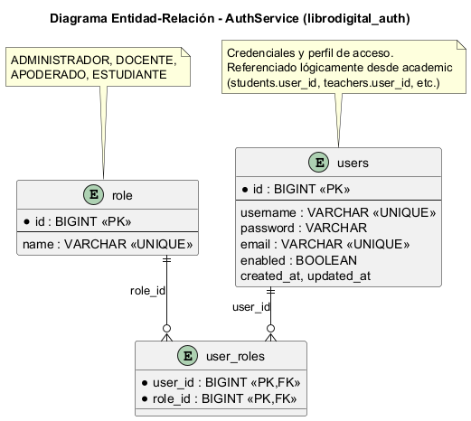
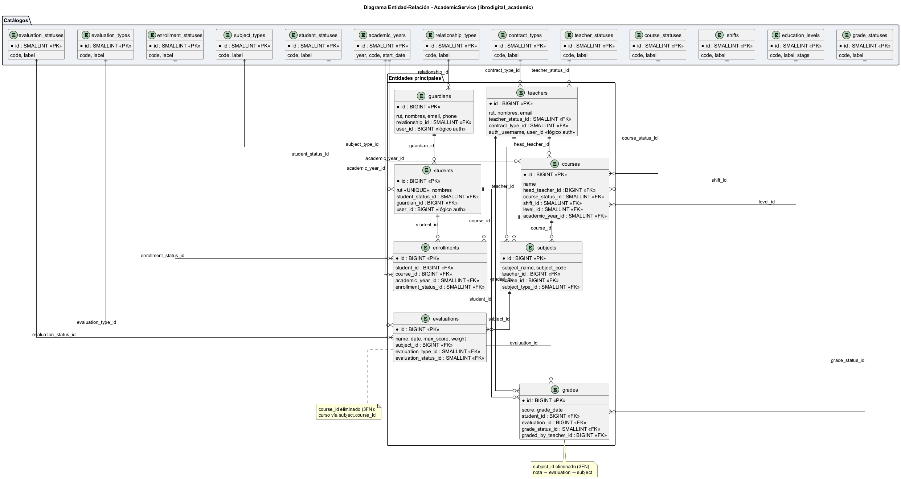
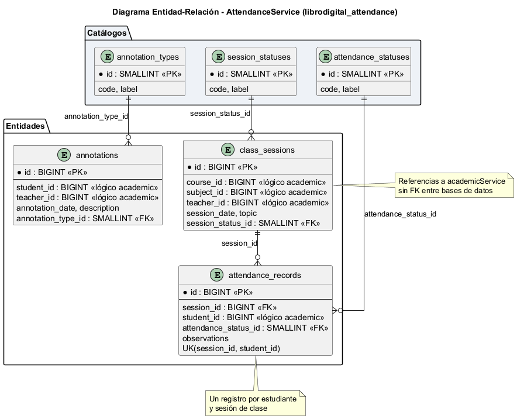

# Examen Transversal — Plataforma Libro de Clases Digital

**Asignatura:** DSY1106 — Desarrollo Fullstack III  
**Proyecto:** Plataforma Libro de Clases Digital  
**Equipo:** Cristian Monsalve / Héctor Olivares  
**Base:** Evaluación Parcial N°3 (2026-06-20)  
**Actualización examen:** 2026-07-13  

Este documento **unifica** en un solo informe: arquitectura de microservicios, persistencia de datos, pruebas unitarias con métricas, repositorios GitHub, y las **mejoras e innovación** del examen (alertas inmediatas a apoderados).

---

# Índice

1. [Arquitectura de microservicios](#parte-i--arquitectura-de-microservicios)
2. [Persistencia de datos](#parte-ii--persistencia-de-datos)
3. [Pruebas unitarias y métricas](#parte-iii--pruebas-unitarias-y-métricas)
4. [Repositorios GitHub](#parte-iv--repositorios-github)
5. [Mejoras post-EP3 e innovación](#parte-v--mejoras-post-ep3-e-innovación-del-examen)
6. [Conclusión general](#conclusión-general)

---

# Parte I — Arquitectura de microservicios

## 1. Resumen ejecutivo

El sistema implementa una **arquitectura de microservicios** para la gestión académica de un colegio: autenticación centralizada, dominio académico (estudiantes, cursos, notas, **mensajería**), dominio de asistencia (sesiones, registros, anotaciones) y un **frontend por roles**. Todos los servicios backend se exponen al exterior a través de un **API Gateway**, y el **frontend React** consume únicamente ese punto de entrada.

La comunicación entre capas es **REST sobre HTTP/JSON**. Cada microservicio persiste en su **propia base PostgreSQL** (patrón *Database per Service*), sin claves foráneas entre bases distintas. Entre microservicios, cuando hace falta orquestación ligera (ej. avisar al apoderado al guardar asistencia), se usa **llamada REST** (`attendanceService` → `academicService`).

## 2. Diagrama de arquitectura


*Fuente editable:* `infraestructura/diagrams/architecture_patterns_simple.puml`

El diagrama muestra:

- **Cliente web** (`frontend-react`, puerto 8094)
- **API Gateway** (`apiGetaway`, puerto 8090) como único punto de entrada
- **Tres microservicios** backend con sus bases de datos dedicadas
- Patrones: API Gateway, Database per Service, Repository, DTO, Service Layer, MVC

## 3. Componentes del sistema

| Componente | Carpeta | Puerto | Responsabilidad |
|------------|---------|--------|-----------------|
| API Gateway | `apiGetaway/` | 8090 | Enrutamiento, CORS, proxy hacia microservicios |
| Auth Service | `authService/` | 8091 | Login, JWT, usuarios, roles (RBAC) |
| Academic Service | `academicService/` | 8092 | Estudiantes, docentes, cursos, matrículas, evaluaciones, notas, **mensajes / alertas** |
| Attendance Service | `attendanceService/` | 8093 | Sesiones de clase, asistencia, anotaciones (+ notify a academic) |
| Frontend React | `frontend-react/` | 8094 | UI por rol (Dirección, Oficina, docente, apoderado, estudiante) |

## 4. Flujo Frontend ↔ Backend ↔ Persistencia

```
┌─────────────────┐
│  frontend-react │  React 19 + TypeScript + Vite
│    :8094        │  VITE_API_URL → http://localhost:8090
└────────┬────────┘
         │  HTTP/JSON + Authorization: Bearer {JWT}
         ▼
┌─────────────────┐
│   apiGetaway    │  Spring Cloud Gateway 2025.1.2
│    :8090        │
└────────┬────────┘
         │
    ┌────┴────┬────────────┬──────────────┐
    ▼         ▼            ▼              ▼
/auth/**  /students/**  /sessions/**   /admin/**
    │     /courses/**   /attendances/**
    │     /grades/**    /annotations/**
    │     /messages/**
    ▼         ▼            ▼
┌────────┐ ┌──────────┐ ┌──────────────┐
│  auth  │ │ academic │ │  attendance  │
│ :8091  │ │  :8092   │ │    :8093     │
└───┬────┘ └────┬─────┘ └──────┬───────┘
    ▼           ▼              ▼
 PostgreSQL   PostgreSQL      PostgreSQL
 librodigital librodigital    librodigital
    _auth       _academic       _attendance
```

### Rutas del Gateway (extracto)

| Prefijo | Destino | Servicio |
|---------|---------|----------|
| `/auth/**` | `http://localhost:8091` | authService |
| `/admin/**` | `http://localhost:8091` | authService |
| `/students/**`, `/courses/**`, `/teachers/**`, `/subjects/**` | `http://localhost:8092` | academicService |
| `/enrollments/**`, `/evaluations/**`, `/grades/**`, `/guardians/**` | `http://localhost:8092` | academicService |
| `/messages/**` | `http://localhost:8092` | academicService (mensajería + notify) |
| `/sessions/**`, `/attendances/**`, `/annotations/**` | `http://localhost:8093` | attendanceService |

El frontend **no** invoca directamente los puertos 8091–8093; siempre usa el gateway en **8090**.

## 5. API REST

- **Colección Postman:** `infraestructura/postman/Libro_Digital.postman_collection.json`
- Flujo: `POST /auth/login` → `Authorization: Bearer {token}` → CRUD academic / attendance según rol

## 6. Seguridad transversal


1. Credenciales a `POST /auth/login`.
2. `authService` valida con **BCrypt** y emite **JWT**.
3. Gateway y microservicios validan el token.
4. **RBAC:** `SUPER_ADMINISTRADOR` (Dirección), `ADMINISTRATIVO` (Oficina), `DOCENTE`, `APODERADO`, `ESTUDIANTE`.
5. Registro público deshabilitado; altas vía `POST /admin/users`.

Usuarios demo (password `test1234`): `admin_colegio`, `admin_oficina`, `prof_castillo`, `apoderado_demo`, `estudiante_demo`.

## 7. Stack tecnológico

| Capa | Tecnologías |
|------|-------------|
| Backend | Java 21, Spring Boot 4.1.0, Spring Security, Spring Data JPA, Maven |
| Gateway | Spring Cloud Gateway 2025.1.2 |
| Frontend | React 19, TypeScript, Vite 8, Tailwind CSS, React Router |
| Base de datos | PostgreSQL 16+ (tres bases lógicas) |
| Testing backend | JUnit 5, Mockito, Spring Boot Test, JaCoCo 0.8.12 |
| API testing | Postman Collection |

## 8. Patrones de diseño

| Patrón | Aplicación |
|--------|------------|
| **API Gateway** | `apiGetaway` centraliza rutas |
| **Database per Service** | Tres bases PostgreSQL independientes |
| **Repository** | `JpaRepository` por entidad |
| **DTO** | Separados de entidades JPA |
| **Service Layer** | Lógica en `*ServiceImpl` |
| **MVC** | Controllers REST + React |

## 9. Orden de arranque

1. PostgreSQL (`infraestructura/ddl/00_create_databases.sql`)
2. `authService` → 8091
3. `academicService` → 8092
4. `attendanceService` → 8093
5. `apiGetaway` → 8090
6. `frontend-react` → 8094

## 10. Diagramas complementarios

| Diagrama | Ubicación |
|----------|-----------|
| ER Auth | `infraestructura/diagrams/auth_er_model.png` |
| ER Academic | `infraestructura/diagrams/academic_er_model.png` |
| ER Attendance | `infraestructura/diagrams/attendance_er_model.png` |
| Autorización RBAC | `infraestructura/diagrams/security_authorization.png` |

---

# Parte II — Persistencia de datos

## 1. Estrategia general

Patrón **Database per Service**: cada microservicio tiene su propia base PostgreSQL.

- Autonomía por dominio, escalabilidad e aislamiento de fallos
- **Sin FK entre bases distintas**; IDs lógicos validados en servicio o vía REST

## 2. Inventario de bases

| Base de datos | Microservicio | Puerto | Script DDL |
|---------------|---------------|--------|------------|
| `librodigital_auth` | authService | 8091 | `infraestructura/ddl/auth_schema.sql` |
| `librodigital_academic` | academicService | 8092 | `infraestructura/ddl/academic_schema.sql` |
| `librodigital_attendance` | attendanceService | 8093 | `infraestructura/ddl/attendance_schema.sql` |

```sql
CREATE DATABASE librodigital_auth;
CREATE DATABASE librodigital_academic;
CREATE DATABASE librodigital_attendance;
```

## 3. Spring Data JPA + Hibernate

```properties
spring.datasource.url=jdbc:postgresql://localhost:5432/librodigital_auth
spring.jpa.hibernate.ddl-auto=update
spring.jpa.properties.hibernate.dialect=org.hibernate.dialect.PostgreSQLDialect
```

Capas: Controller → Service → Repository → Entidad JPA → PostgreSQL.

En producción: `ddl-auto=validate` + scripts versionados en `infraestructura/ddl/`.

## 4. Esquemas por servicio

### 4.1 librodigital_auth



| Tabla | Descripción |
|-------|-------------|
| `users` | Credenciales, email, estado |
| `role` | Catálogo de roles |
| `user_roles` | N:M usuario ↔ rol |

### 4.2 librodigital_academic (3FN)



- Catálogos: estados, tipos de evaluación, años académicos, etc.
- Entidades: `guardians`, `teachers`, `students`, `courses`, `subjects`, `enrollments`, `evaluations`, `grades`
- **Mensajería (examen):** `conversations`, `messages`, `conversation_read_states` — avisos a apoderados (asistencia / evaluaciones) en conversaciones TG

### 4.3 librodigital_attendance



| Tabla | Descripción |
|-------|-------------|
| `class_sessions` | Sesión (fecha, curso, asignatura, docente; sustituto opcional) |
| `attendance_records` | Asistencia P/A/R/J |
| `annotations` | Anotaciones de conducta |

Referencias lógicas a academic: `course_id`, `subject_id`, `teacher_id`, `student_id` (sin FK física). Al guardar asistencia, attendance puede **llamar a academic** para notificar; el mensaje **no** se duplica en la BD de attendance.

## 5. Scripts y migraciones

| Archivo | Uso |
|---------|-----|
| `00_create_databases.sql` | Crear las 3 bases |
| `auth_schema.sql` / `academic_schema.sql` / `attendance_schema.sql` | Esquema + demo |
| `migrations/001–004` | Actualizar BDs antiguas |

**No se usan procedimientos almacenados:** JPA/Hibernate + JPQL + DDL versionado.

## 6. Transacciones y seguridad de datos

- Transacciones **locales** (`@Transactional`); sin 2PC entre servicios
- Consistencia eventual por validación de IDs y APIs
- Contraseñas **BCrypt**; JWT stateless; DTOs sin campos sensibles

## 7. Datos de demostración

| Usuario | Rol | Contraseña |
|---------|-----|------------|
| `admin_colegio` | SUPER_ADMINISTRADOR (Dirección) | `test1234` |
| `admin_oficina` | ADMINISTRATIVO (Oficina) | `test1234` |
| `prof_castillo` | DOCENTE | `test1234` |
| `apoderado_demo` | APODERADO | `test1234` |
| `estudiante_demo` | ESTUDIANTE | `test1234` |

Tras pasar lista o crear evaluación, los avisos quedan en `messages` (academic).

---

# Parte III — Pruebas unitarias y métricas

**Fecha de ejecución (métricas EP3):** 2026-06-20  

La innovación de alertas se valida preferentemente con **demo funcional** (docente → apoderado). En defensa se puede ejecutar un `mvn test` / `npm test` en vivo.

## 1. Resumen ejecutivo

| Servicio | Clases de test | Métodos de test | Cobertura instrucciones | Cobertura ramas |
|----------|----------------|-----------------|-------------------------|-----------------|
| **authService** | 7 | 33 | **91 %** | **71 %** |
| **academicService** | 27 | 147 | **71 %** | **49 %** |
| **attendanceService** | 13 | 84 | **80 %** | **60 %** |
| **apiGetaway** | 1 | 1 | N/A* | N/A* |
| **frontend-react** | 10 | 53 | **6 %** global** | **3 %** global** |
| **Total** | **58** | **318** | — | — |

\* Gateway: smoke `contextLoads`.  
\*\* Módulos críticos frontend con alta cobertura: `permissions.ts` 94 %, `Login.tsx` 92 %, `client.ts` 100 %.

**Resultado:** backend `BUILD SUCCESS` + **53/53** frontend — **318 tests**, **0 fallos**.

## 2. Herramientas

JUnit 5, Mockito, Spring Boot Test, JaCoCo 0.8.12, Maven Surefire, Vitest 4, React Testing Library, @vitest/coverage-v8.

```powershell
cd authService
mvn clean test jacoco:report
# → target/site/jacoco/index.html

cd frontend-react
npm run test:coverage
# → coverage/index.html
```

Copias en el encargo: `informe-ep3/jacoco-reports/` y `informe-ep3/coverage-frontend/`.

## 3. Cobertura por servicio (síntesis)

```
authService       ██████████████████████████████████████████████  91%
attendanceService ████████████████████████████████████████        80%
academicService   ███████████████████████████████████             71%
```

- **auth:** controllers, login, admin users, JWT, excepciones  
- **academic:** CRUD pedagógico, seguridad, validadores  
- **attendance:** sesiones, asistencia, anotaciones, validación  

## 4. Ejemplo backend (login)

```java
@Test
void login_success() {
    when(userRepository.findByUsername("prof_castillo")).thenReturn(Optional.of(user));
    when(passwordEncoder.matches("test1234", "encoded")).thenReturn(true);
    when(jwtUtil.generateToken(user)).thenReturn("mock-jwt-token");
    AuthResponse response = authService.login(request);
    assertEquals("mock-jwt-token", response.getAccessToken());
}
```

## 5. Frontend — módulos críticos

| Archivo | Líneas | Qué se prueba |
|---------|--------|---------------|
| `auth/permissions.ts` | 94 % | RBAC |
| `Login.tsx` | 92 % | Login y validación |
| `api/client.ts` | 100 % | URLs y JWT |
| Validadores RUT/email/fecha | 93–100 % | Formularios |

Integración complementaria: colección **Postman** vía gateway `:8090` + E2E manual por rol.

## 6. Conclusión de pruebas

Las suites cubren autenticación, CRUD, asistencia, permisos y validadores con métricas JaCoCo/Vitest (EP3). La innovación del examen se demuestra con flujo E2E: guardar lista / crear evaluación → mensaje en `apoderado_demo`. El notify es **best-effort** (no rompe el CRUD si falla la mensajería).

---

# Parte IV — Repositorios GitHub

| Repositorio | URL |
|-------------|-----|
| Infraestructura | https://github.com/cristianmonsalve14/infraestructura |
| Frontend React | https://github.com/cristianmonsalve14/frontend-react |
| API Gateway | https://github.com/cristianmonsalve14/apiGetaway |
| Auth Service | https://github.com/cristianmonsalve14/authService |
| Academic Service | https://github.com/cristianmonsalve14/academicService |
| Attendance Service | https://github.com/cristianmonsalve14/attendanceService |

| Servicio | Puerto | BD |
|----------|--------|-----|
| apiGetaway | 8090 | — |
| authService | 8091 | `librodigital_auth` |
| academicService | 8092 | `librodigital_academic` |
| attendanceService | 8093 | `librodigital_attendance` |

El workspace local agrupa los módulos; en GitHub cada componente tiene su repositorio.

---

# Parte V — Mejoras post-EP3 e innovación del examen

## 1. Contexto

Tras la **presentación N°3**, el equipo incorporó el feedback docente y la **mejora innovadora** recomendada: al registrar asistencia o publicar una evaluación, el sistema **avisa de inmediato a los apoderados** por la mensajería interna.

## 2. Feedback EP3 → acciones

| Feedback | Respuesta | Evidencia |
|----------|-----------|-----------|
| Agilizar demo (app, código, BD, tests) | App lista en PC + checklist | README + stack levantado |
| Claridad de roles y flujos reales | Dirección vs Oficina; panel docente por curso | RBAC + UI |
| **Innovación: alertas a apoderados** | Notify al guardar lista y al crear evaluación | Mensajería TG |
| Comunicación familia–colegio | Mensajes contextuales | Conversaciones TG |

## 3. Innovación: alertas inmediatas a apoderados

### Problema

El apoderado suele enterarse tarde de ausencias o fechas de prueba. La innovación acerca el Libro Digital a la realidad: **cuando el docente actúa, la familia recibe el aviso al instante** en la misma plataforma.

### Idea central

| Evento docente | Efecto automático |
|----------------|-------------------|
| Guardar asistencia (P / A / R / J) | Mensaje TG al apoderado (si tiene asignado) |
| Crear evaluación | Mensaje TG a apoderados del curso |

- **Best-effort:** si falla el aviso, la lista/evaluación igual se guarda  
- **ConfirmDialog** en UI aviso antes de publicar  

### Arquitectura del flujo

```
Docente (React) + ConfirmDialog
        │ JWT / Gateway :8090
        ▼
attendanceService ──REST──► academicService  POST /messages/attendance-notify
                             MessageServiceImpl.notifyGuardianAttendance
academicService (crear eval)
  EvaluationController ──► notifyGuardiansEvaluationCreated
                             │
                             ▼
                    conversations / messages (PostgreSQL academic)
                             │
                             ▼
                    Apoderado → módulo Mensajes
```

### Ejemplo de aviso (asistencia)

```
Aviso de asistencia
Alumno: Juan Perez
Asignatura: Matemática
Fecha de la clase: 13-07-2026
Estado: Ausente (A)

Este mensaje se generó automáticamente al registrar la asistencia de la clase.
```

### Ejemplo de aviso (evaluación)

```
Aviso de evaluación
Alumno: Juan Perez
Curso: 1° Medio A
Asignatura: Matemática
Evaluación: Prueba unidad 2
Tipo: PRUEBA
Fecha: 15-07-2026

Este mensaje se generó automáticamente al publicar una nueva evaluación.
```

### Por qué es innovadora

1. Ciclo docente → familia en segundos  
2. Misma plataforma (mensajería TG)  
3. Resiliencia (core no depende del canal)  
4. Trazabilidad en la conversación  
5. UX segura con confirmación  
6. Coherente con microservicios: attendance **delega** en academic  

### Código clave

| Área | Ubicación |
|------|-----------|
| Cliente notify | `AcademicApiClient.notifyGuardianAttendance` |
| API | `POST /messages/attendance-notify` |
| Lógica TG | `MessageServiceImpl` |
| Evaluaciones | `EvaluationController` → `notifyGuardiansEvaluationCreated` |
| UI | `ConfirmDialog.tsx`, `Attendance.tsx`, `Evaluations.tsx` |

### Demo (2–3 min)

1. `prof_castillo` → Asistencia → confirmar → guardar  
2. `apoderado_demo` → Mensajes → ver aviso  
3. Docente → crear evaluación → confirmar  
4. Apoderado → ver aviso de evaluación  

## 4. Otras mejoras post-EP3

- Mensajería por roles (AD, AG, AS, **TG**, TS); Distinción Dirección / Oficina  
- Nota final: prom. semestre (CONTROL/PRUEBA/TRABAJO) + % colegio + examen; export Excel/PDF  
- Asistencia tipo planilla; clases y sustitutos; confirmaciones al guardar  
- Contexto docente por curso; vínculo ficha ↔ usuario auth  

## 5. Impacto técnico

| Aspecto | EP3 | Examen |
|---------|-----|--------|
| Familia | Consulta portal | Mensajes + alertas automáticas |
| academic | CRUD | + MessageService + notify |
| attendance | Sesiones/registros | + REST a academic al guardar lista |
| Frontend | CRUD por rol | Mensajes, ConfirmDialog, exports |
| Persistencia | 3 BD | Sin 4.ª BD; mensajes en academic |

---

# Conclusión general

La plataforma cumple el encargo de Fullstack III con **microservicios**, **persistencia independiente**, **API vía gateway**, **pruebas con métricas** y repositorios publicados. Para el examen, sobre esa base se incorporó el feedback de la presentación N°3 y una **mejora innovadora concreta**: alertas inmediatas a apoderados al pasar lista y al publicar evaluaciones, integradas en la mensajería del colegio, con confirmación en UI y diseño resiliente entre servicios.
